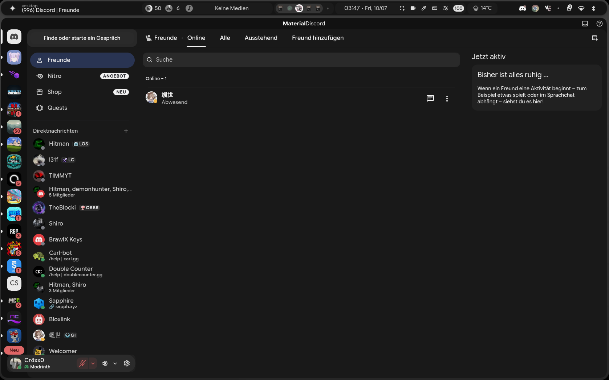
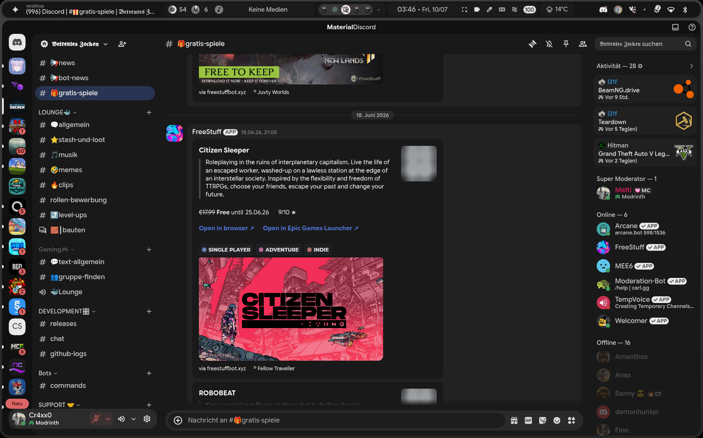

<div align="center">

# Material Discord (Dark Grey Fork)

A Material You (MD3 Expressive) fork of Material Discord.

---

</div>

> [!IMPORTANT]
> **No files available yet:** I am currently on vacation and forgot to transfer a copy of the theme files to my mobile device. The repository files will be uploaded as soon as I am back home.

---

## About the Project

Ich hatte etwas Zeit und mir war langweilig, I had some free time and was a bit bored, so I decided to create a fork of Material Discord.
In this fork, I adjusted the overall design by tweaking the color palette, rounding various UI elements, and redesigning the server list view.
I would really appreciate any feedback! I've already noticed a few bugs myself and will be working on fixing them soon. Alternatively, you're more than welcome to help out—I’m always open to your commits, both here on GitHub and in the chat.
---

## Preview

| View 1 | View 2 |
| :---: | :---: |
|  |  |

*Click on the images to view them in full resolution.*

---

## Key Changes & Features

* Adjusted color palette (Dark Grey style)
* Rounded UI elements following modern design guidelines
* Redesigned server list view
* Codebase and dependencies updated

---

## Tested On

This theme / client mod is tested and working on:

| Client Mod | Platform |
| :--- | :--- |
| Vesktop | Linux / Windows |
| Vencord | Web / Desktop |
| BetterDiscord | Desktop |

---

## Installation

### Method 1: Direct Import
Paste the following line into your client's custom CSS settings:

```css
@import url("[https://raw.githubusercontent.com/Cr4xx0Dev/Material-Discord-dark-grey/main/material-discord.theme.css](https://raw.githubusercontent.com/Cr4xx0Dev/Material-Discord-dark-grey/main/material-discord.theme.css)");
Method 2: Manual Download
Download the repository or theme file.
Place the file into your client mod's themes folder.
Enable the theme in your Discord settings.
Credits & Links
Original Project: Material-Discord by CapnKitten
Repository: Material-Discord-dark-grey
Profile: Cr4xx0Dev on GitHub
<div align="center">
Created by Cr4xx0Dev
</div>
